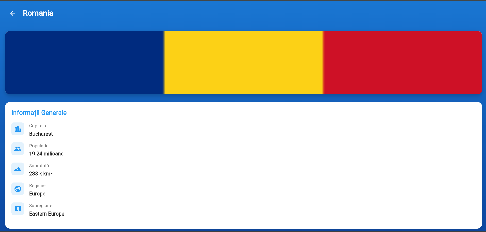

<div align="center">

# 🌍 **Enciclopedie Țări**

</div>

**Enciclopedie Țări** este o aplicație Flutter modernă care transformă explorarea geografică într-o experiență vizuală captivantă. Descoperă informații complete despre toate țările lumii, de la date demografice până la detalii culturale și economice, totul într-o interfață elegantă și intuitivă.

---

## ✨ **Experiența Utilizatorului** 

Aplicația este construită în jurul a trei piloni fundamentali: **Simplitate**, **Informație Completă** și **Design Modern**.

### 🎯 Funcționalități Principale

🔍 **Căutare Inteligentă**: Găsește rapid orice țară sau capitală printr-un sistem de căutare în timp real  
🌐 **Filtrare pe Continente**: Explorează țările pe regiuni - Africa, Asia, Europa, Americi, Oceania  
📊 **Informații Complete**: Populație, suprafață, capitală, monedă, limbă și subregiune  
🚩 **Steaguri HD**: Imagini de calitate preluate de la REST Countries API  
🎨 **Design Premium**: Interfață cu gradient albastru, carduri elevate și animații fluide  
📱 **100% Responsive**: Experiență optimă pe mobile, tablet, web și desktop  

---

## 🏗️ **Arhitectura Proiectului**

Codul este organizat modular pentru a respecta bunele practici de dezvoltare și pentru a asigura o mentenabilitate ridicată:

```
lib/
├── 📱 main.dart                    # Punctul de lansare & Tema aplicației
├── 📦 models/
│   └── country.dart                # Model de date pentru țări
├── 💾 data/
│   └── hardcoded_countries.dart    # Date de backup (fallback)
├── 🔌 services/
│   └── country_service.dart        # Integrare REST Countries API
├── 🛠️ utils/
│   └── formatters.dart             # Formatare populație & suprafață
├── 🧩 widgets/                     # Componente UI reutilizabile
│   ├── country_card.dart           # Card țară cu steag și info
│   ├── country_list_header.dart    # Header cu titlu și contor
│   ├── search_bar.dart             # Bară de căutare
│   ├── region_filter.dart          # Chip-uri filtrare regiuni
│   ├── flag_card.dart              # Card mare pentru steag
│   ├── info_section.dart           # Secțiune informații
│   ├── info_row.dart               # Rând individual cu iconiță
│   ├── loading_indicator.dart      # Indicator încărcare
│   ├── empty_state.dart            # Ecran gol
│   └── api_footer.dart             # Footer cu sursa datelor
└── 🖼️ screens/                     # Ecranele principale
    ├── country_list_screen.dart    # Lista cu toate țările
    └── country_details_screen.dart # Detalii complete țară
```

---

## 🛠️ **Detalii Tehnice de Implementare**

| **Caracteristică** | **Tehnologie / Widget Utilizat** |
|-------------------|----------------------------------|
| **State Management** | StatefulWidget cu setState pentru căutare și filtrare |
| **Navigare** | Navigator.push pentru tranziții între ecrane |
| **API Integration** | REST Countries API v3.1 cu fallback la date locale |
| **HTTP Client** | package:http pentru request-uri asincrone |
| **Layout Principal** | Column & ListView.builder pentru liste scrollabile |
| **Layout Detalii** | SingleChildScrollView pentru ecranul de detalii |
| **UI Components** | FilterChip, Card, TextField, Material Design 3 |
| **Responsiveness** | SafeArea și layout-uri adaptive |
| **Formatare Date** | Funcții custom pentru populație (milioane/miliarde) și suprafață (km²) |
| **Error Handling** | Try-catch cu date hardcodate ca backup |

---

## 🌍 **Date Disponibile pentru Fiecare Țară**

### 📋 Informații Generale
- 🏛️ **Capitală** - Orașul principal
- 👥 **Populație** - Formatată (ex: 19.24 milioane)
- 🗺️ **Suprafață** - În km² (ex: 238.39 k km²)
- 🌐 **Regiune** - Continentul (Africa, Asia, Europe, etc.)
- 📍 **Subregiune** - Zona specifică (Eastern Europe, etc.)

### 💰 Informații Financiare & Culturale
- 💵 **Monedă** - Nume și simbol (ex: Euro €)
- 🗣️ **Limbă** - Limba/limbile oficiale

### 🚩 Media
- Steaguri HD de la [flagcdn.com](https://flagcdn.com)

---

## 📊 **Sursa Datelor**

Aplicația folosește [**REST Countries API v3.1**](https://restcountries.com) - un API gratuit și open-source care oferă informații despre toate țările recunoscute internațional (250+ țări).

**Caracteristici API:**
- ✅ Gratuit, fără autentificare
- ✅ Date actualizate constant
- ✅ Imagini steaguri în format PNG
- ✅ 10+ țări hardcodate ca backup în caz de eroare

---

## 🚀 **Instalare și Rulare**

### 📋 **Pași de Instalare**

**1.** Clonează repository-ul:
```bash
git clone https://github.com/your-username/tema_laborator.git
cd tema_laborator
```

**2.** Verifică integritatea mediului Flutter:
```bash
flutter doctor
```

**3.** Instalează dependențele:
```bash
flutter pub get
```

**4.** Lansează aplicația:
```bash
# Pentru mobile (Android/iOS)
flutter run

# Pentru web
flutter run -d chrome

# Pentru desktop (Windows/macOS)
flutter run -d windows
flutter run -d macos
```

---

## 📦 **Dependențe**

```yaml
dependencies:
  flutter:
    sdk: flutter
  cupertino_icons: ^1.0.8
  http: ^1.2.0              # Pentru request-uri HTTP către API
  shared_preferences: ^2.2.2 # Pentru salvare date locale (viitor)
```

---

## 📱 **Platforme Suportate**

<table>
  <tr>
    <td align="center">📱</td>
    <td><b>Mobile</b></td>
    <td>iOS & Android (Interfață adaptivă cu gradient și carduri)</td>
  </tr>
  <tr>
    <td align="center">🌐</td>
    <td><b>Web</b></td>
    <td>Optimizat pentru Chrome/Safari/Edge cu lazy loading imagini</td>
  </tr>
  <tr>
    <td align="center">💻</td>
    <td><b>Desktop</b></td>
    <td>Windows, macOS & Linux (Layout responsive)</td>
  </tr>
</table>

---

## 🎨 **Design și Interfață**

### Paletă de Culori
- **Gradient Fundal**: Blue[700] → Blue[900]
- **Carduri**: White cu shadow subtil
- **Accent**: Blue[100] pentru badge-uri de regiune
- **Text**: White pentru header, Black87 pentru conținut

### Tipografie
- **Header**: 28pt Bold
- **Titluri Țări**: 18pt Bold
- **Body Text**: 14-16pt Regular
- **Labels**: 12-14pt Medium

---

## 📸 **Capturi de Ecran**

Sistemul vizual folosește un fundal cu gradient albastru și carduri elevate pentru un contrast modern.

<table>
  <tr>
    <td align="center"><b>Pagina Principală</b></td>
    <td align="center"><b>Detalii Țară - România</b></td>
  </tr>
  <tr>
    <td></td>
    <td></td>
  </tr>
</table>

---

## 🔮 **Funcționalități Viitoare**

- [ ] 📌 Salvare țări favorite
- [ ] 🌙 Dark mode
- [ ] 📊 Comparare între două țări
- [ ] 🗺️ Integrare hartă interactivă
- [ ] 🔔 Notificări despre schimbări demografice
- [ ] 🌐 Suport multi-limbă (EN/RO)

---

## 👨‍💻 **Dezvoltare**

### Structura Codului

**Principii Aplicate:**
- ✅ **Separarea responsabilităților** - Models, Services, Widgets, Screens
- ✅ **Widget-uri mici și reutilizabile** - Max 60 linii per fișier widget
- ✅ **Cod DRY** - Evitarea duplicării prin extragerea în funcții
- ✅ **Formatare automată** - Dart formatter pentru consistență

### Testare

```bash
# Analiză statică
flutter analyze

# Formatare cod
flutter format lib/

# Testare
flutter test
```

---

## 📄 **Licență**

Acest proiect este dezvoltat în scop educațional pentru învățarea Flutter.

---

## 🙏 **Mulțumiri**

- [REST Countries API](https://restcountries.com) - Pentru datele gratuite despre țări
- [Flag CDN](https://flagcdn.com) - Pentru imaginile steagurilor
- [Flutter](https://flutter.dev) - Pentru framework-ul cross-platform
- Comunitatea Flutter România 🇷🇴

---

<div align="center">


⭐ **Dacă îți place proiectul, oferă-i un star!** ⭐

</div>